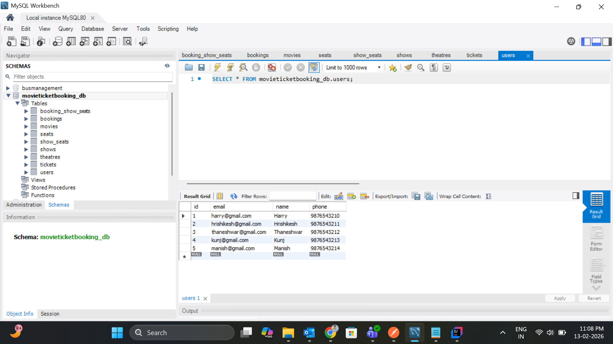
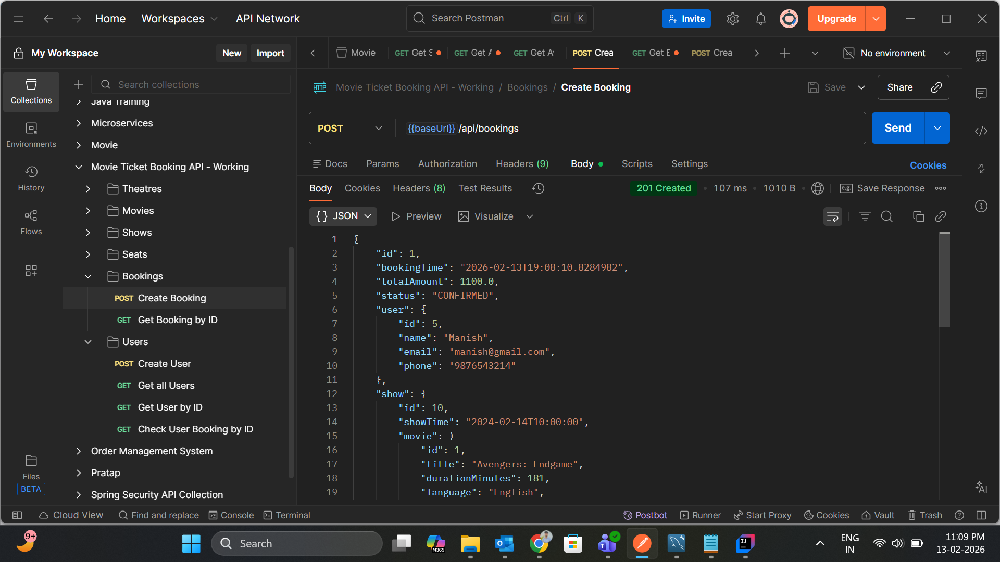

## Movie Ticket Booking System

This is a Spring Boot based REST API for managing movies, theatres, shows, seats, users, and bookings for a simple movie ticket booking system.

---

## Bean Validation

We use **Jakarta Bean Validation** (`jakarta.validation`) to validate incoming request payloads before they reach the service layer.

- **DTO-level annotations**  
  Example: `UserDto` uses field-level constraints to ensure required data is present and correctly formatted.

  ```java
  public class UserDto {

      private Long id;

      @NotBlank(message = "Name is required")
      private String name;

      @NotBlank(message = "Email is required")
      @Email(message = "Email should be valid")
      private String email;

      @NotBlank(message = "Phone is required")
      private String phone;
  }
  ```

- **Triggering validation in controllers**  
  Controllers use `@Valid` on `@RequestBody` parameters, so Spring automatically runs Bean Validation and raises a `MethodArgumentNotValidException` if constraints fail.

  ```java
  @PostMapping
  public ResponseEntity<UserDto> createUser(@Valid @RequestBody UserDto request) {
      UserDto createdUser = userService.createUser(request);
      return new ResponseEntity<>(createdUser, HttpStatus.CREATED);
  }
  ```

- **Business-rule validation in services**  
  In addition to bean constraints, we also check business rules like **unique email** at the service layer:

  ```java
  public UserDto createUser(UserDto request) {
      if (userRepository.existsByEmail(request.getEmail())) {
          throw new RuntimeException("User already exists with email: " + request.getEmail());
      }
      // map & save user...
  }
  ```

---

## Error Handling with `@ControllerAdvice`

Centralized error handling is implemented in `GlobalExceptionHandler` using `@RestControllerAdvice`. This ensures consistent error responses across the API.

- **Handling `RuntimeException` (business errors)**  
  Any uncaught `RuntimeException` (for example, "User already exists", "Show not found") is mapped to a **400 Bad Request** with a structured JSON body.

  ```java
  @ExceptionHandler(RuntimeException.class)
  public ResponseEntity<ErrorResponse> handleRuntimeException(RuntimeException ex, WebRequest request) {
      ErrorResponse errorResponse = new ErrorResponse(
              LocalDateTime.now(),
              HttpStatus.BAD_REQUEST.value(),
              "Bad Request",
              ex.getMessage(),
              request.getDescription(false).replace("uri=", "")
      );
      return new ResponseEntity<>(errorResponse, HttpStatus.BAD_REQUEST);
  }
  ```

- **Handling Bean Validation errors**  
  When `@Valid` fails, Spring throws `MethodArgumentNotValidException`. We collect all field errors into a map and return them as a single **Validation Error** response.

  ```java
  @ExceptionHandler(MethodArgumentNotValidException.class)
  public ResponseEntity<ErrorResponse> handleValidationExceptions(MethodArgumentNotValidException ex,
                                                                  WebRequest request) {
      Map<String, String> errors = new HashMap<>();
      ex.getBindingResult().getFieldErrors().forEach(error ->
              errors.put(error.getField(), error.getDefaultMessage())
      );

      ErrorResponse errorResponse = new ErrorResponse(
              LocalDateTime.now(),
              HttpStatus.BAD_REQUEST.value(),
              "Validation Error",
              errors.toString(),
              request.getDescription(false).replace("uri=", "")
      );
      return new ResponseEntity<>(errorResponse, HttpStatus.BAD_REQUEST);
  }
  ```

- **Fallback for unexpected exceptions**  
  Any other unhandled exception is treated as an **Internal Server Error (500)**:

  ```java
  @ExceptionHandler(Exception.class)
  public ResponseEntity<ErrorResponse> handleGlobalException(Exception ex, WebRequest request) {
      ErrorResponse errorResponse = new ErrorResponse(
              LocalDateTime.now(),
              HttpStatus.INTERNAL_SERVER_ERROR.value(),
              "Internal Server Error",
              ex.getMessage(),
              request.getDescription(false).replace("uri=", "")
      );
      return new ResponseEntity<>(errorResponse, HttpStatus.INTERNAL_SERVER_ERROR);
  }
  ```

All error responses share the same `ErrorResponse` structure (timestamp, status, error, message, path), making it easier for clients to handle errors consistently.

---

### Database Schema



### API Documentation (Postman Collection)



---

